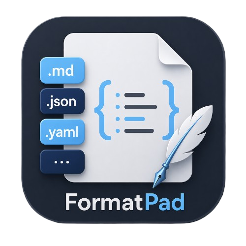

# FormatPad

<p align="center">
  
</p>

A fast, multi-format viewer and editor for Windows and macOS. Open Markdown,
JSON, YAML, CSV/TSV, TOML, XML, HTML, Mermaid, INI/conf, .env, log, and plain
text in one app — every format gets a dedicated viewer and toolbar, and every
viewer is editable.

## Why FormatPad?

Good file viewers usually specialize — JSON Editor Online for JSON, Modern
CSV for CSV, Typora for Markdown, Mermaid Live Editor for diagrams. Five
formats means five apps, five clipboards, several browser tabs.

FormatPad is **one desktop app where every format has its own first-class,
editable viewer**:

- **JSON** → tree view with JSONPath queries and side-by-side diff
- **CSV / TSV** → spreadsheet grid with sort, filter, column operations
- **Markdown** → split-view live preview with KaTeX math, Mermaid, GFM,
  wiki-style `[[links]]` with backlinks
- **YAML / TOML / INI** → structured tree inspection + cross-format
  conversion
- **XML** → tree view with XPath
- **HTML** → rendered preview with outline, Markdown export
- **Mermaid** → live diagram synced with source
- **.env** → typed key-value table

Every view **round-trips through the text editor** — change a cell in the
CSV grid and the underlying text updates; edit the text and the grid
refreshes. Scroll sync works both ways: cursor movement in the editor
follows the preview and vice versa.

All local. No cloud, no subscription, no account.

## Features

### Viewers and formats
- Structured views for JSON (tree + JSONPath + diff), CSV/TSV (spreadsheet
  grid), YAML/TOML/INI (tree), XML (tree + XPath), HTML (rendered +
  outline), Mermaid (live diagram), .env (key/value table), JSONL/NDJSON
  (grid for homogeneous records)
- Plain text / log fallback with per-format syntax highlighting

### Markdown
- GitHub Flavored Markdown: tables, task lists, strikethrough, `==highlight==`
- KaTeX math — inline `$...$` and block `$$...$$`
- Mermaid diagrams in fenced ` ```mermaid ` blocks
- `highlight.js` code blocks with auto-detect and copy button
- Wiki-style `[[links]]` with autocompletion and a backlinks panel
- HTML / PDF export with full theme styling

### Editor / UX
- CodeMirror 6 with per-format syntax highlighting, line wrapping, code folding
- Multi-tab with drag reorder, pin, middle-click close, Ctrl+Tab
- Split / editor-only / preview-only view modes
- Bidirectional editor↔preview scroll sync
- Per-format format bar (Markdown formatting, CSV column ops,
  JSON validate / JSONPath / diff, XPath, ...)
- Clipboard image paste → `./assets/`
- Auto-save with crash recovery on restart
- Drag-and-drop file open

### Sidebar
- **Files** — real-time file tree watcher, context menu (new / rename / delete)
- **Search** — workspace-wide text search with regex and case filter, scoped by extension
- **TOC** — per-format outline (headings for Markdown, keys for JSON/YAML,
  elements for XML/HTML, columns for CSV) with scroll-spy
- **Links** — backlinks for Markdown wikilinks

### Theming / i18n
- 16 built-in themes — GitHub Light/Dark, Tokyo Night, Dracula, Nord,
  Catppuccin, Gruvbox, and more
- Custom theme creation with live preview
- 30 languages — selected at install or switched at runtime

### Platform
- Windows NSIS installer (multi-language), registers as default handler
  for 20+ extensions
- macOS universal DMG (arm64 + x64)
- In-app auto-update via GitHub Releases API

## Keyboard shortcuts

| Shortcut | Action |
|----------|--------|
| Ctrl+N | New file |
| Ctrl+O | Open file |
| Ctrl+S | Save |
| Ctrl+Shift+S | Save As |
| Ctrl+W | Close tab |
| Ctrl+Tab | Next tab |
| Ctrl+Shift+Tab | Previous tab |
| Ctrl+B | Bold (Markdown) |
| Ctrl+I | Italic (Markdown) |
| Ctrl+K | Link (Markdown) |
| Ctrl+T | Toggle TOC sidebar |
| Ctrl+Shift+E | File explorer sidebar |
| Ctrl+Shift+F | Search in files |

## Install

Grab the installer for your platform from the [latest release](../../releases/latest).

### Windows

Run the `.exe` installer and follow the setup wizard.

### macOS

Mount the `.dmg` and launch FormatPad directly from the DMG, or drag it to
`/Applications` (or any writable location like `~/Desktop/`) first.

FormatPad isn't signed with an Apple Developer ID yet, so on first launch
macOS blocks it with *"Apple could not verify FormatPad is free of
malware..."* Clear the quarantine flag once from Terminal:

```bash
xattr -cr /Applications/FormatPad.app   # or wherever you placed it
open /Applications/FormatPad.app
```

The recursive `-cr` is needed because Electron apps have nested helper
binaries, each carrying a separate quarantine flag — a plain
`xattr -d com.apple.quarantine` on the bundle isn't enough. FormatPad
opens normally on subsequent launches.

With admin rights, an alternative is **System Settings → Privacy &
Security → Open Anyway** once the blocked-app notice appears there.

## Build

```bash
npm install

# Run desktop app (development)
npm start

# Build desktop installer for the current platform
npm run dist:win    # Windows NSIS installer (.exe)
npm run dist:mac    # macOS universal DMG (must be run on macOS)
```

## Tech stack

- [Electron 33](https://www.electronjs.org/) — Desktop app framework
- [CodeMirror 6](https://codemirror.net/) — Editor engine
- [marked](https://marked.js.org/) — Markdown parser
- [highlight.js](https://highlightjs.org/) — Code syntax highlighting
- [KaTeX](https://katex.org/) — Math rendering
- [Mermaid](https://mermaid.js.org/) — Diagram rendering
- [PapaParse](https://www.papaparse.com/) — CSV/TSV parser
- [js-yaml](https://github.com/nodeca/js-yaml) — YAML parser
- [smol-toml](https://github.com/squirrelchat/smol-toml) — TOML parser
- [Ajv](https://ajv.js.org/) — JSON schema validation
- [DOMPurify](https://github.com/cure53/DOMPurify) — HTML sanitization
- [jsonrepair](https://github.com/josdejong/jsonrepair) — JSON repair
- [Turndown](https://github.com/mixmark-io/turndown) — HTML → Markdown
- [esbuild](https://esbuild.github.io/) — Bundler

## License

MIT
